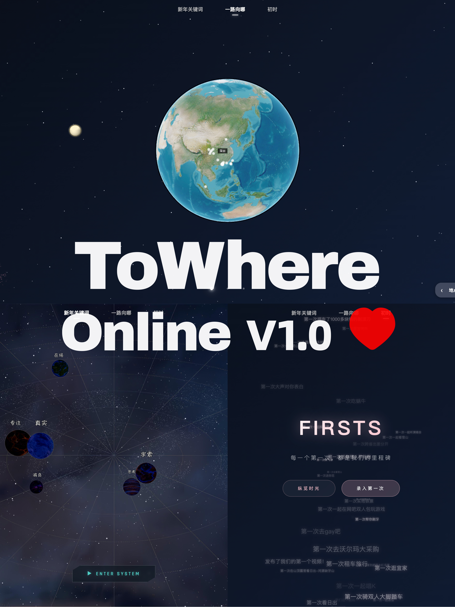
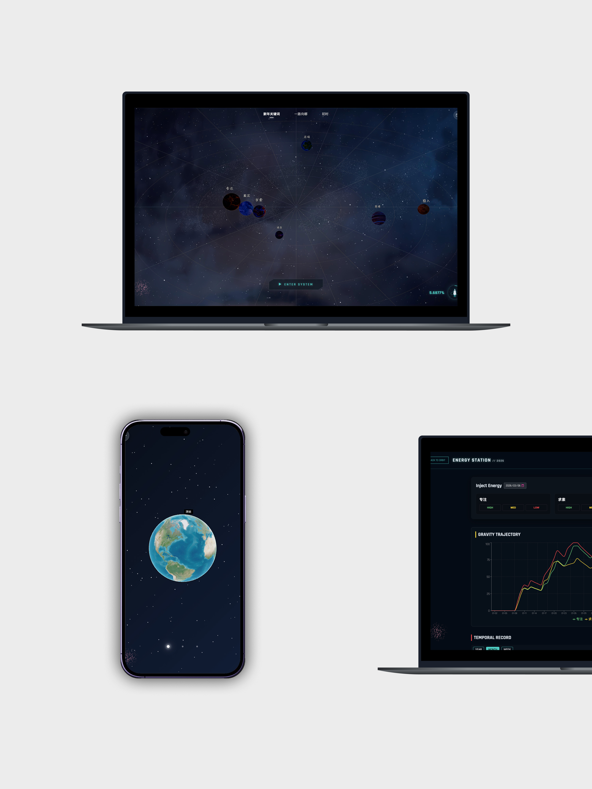
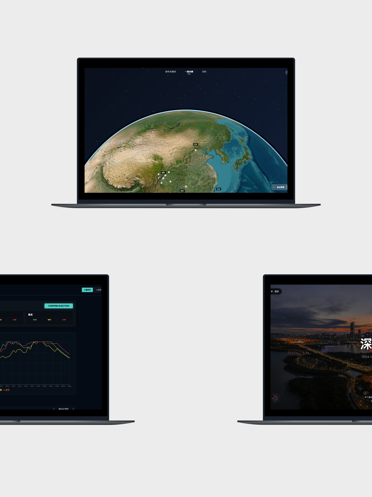
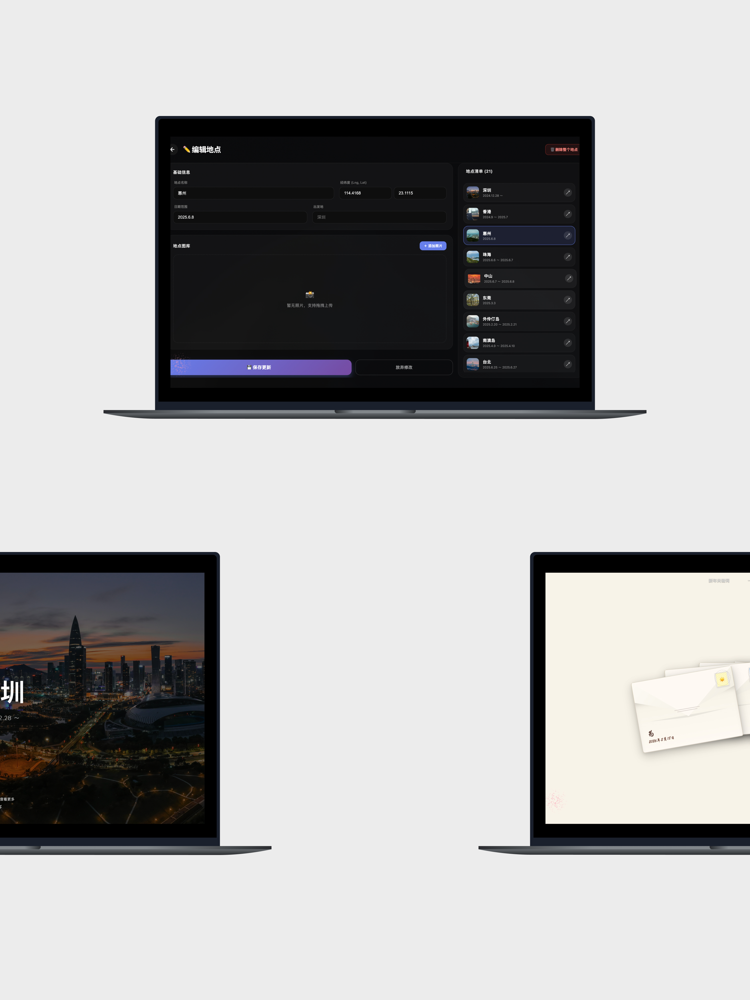
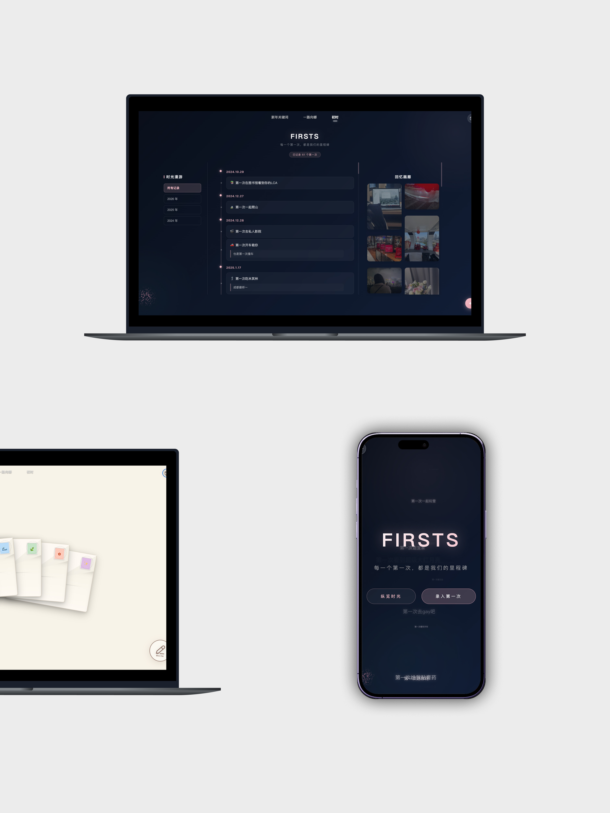

# ToWhere Online V1.0

> A private universe for travel memories, first moments, letters, and daily energy.



ToWhere Online is an interactive memory archive built with React. It turns places, photos, words, and small daily records into a visual space that can be opened, explored, and revisited.

It started as a personal gift, so the product shape is intentionally intimate: a starry entry, a living globe, city memories, FIRSTS timeline, letters, music, and an Energy Station for recording emotional gravity over time.

## Preview

<table>
  <tr>
    <td width="33%" align="center">
      
    </td>
    <td width="33%" align="center">
      
    </td>
    <td width="33%" align="center">
      
    </td>
  </tr>
  <tr>
    <td width="33%" align="center">
      
    </td>
    <td width="33%" align="center">
      
    </td>
    <td width="33%" align="center">
      
    </td>
  </tr>
</table>

## What It Does

### ToWhere Globe

The main travel view places memories on a globe. Cities become points in space, and each place can lead into a dedicated detail page with photos and story fragments.

### FIRSTS Timeline

FIRSTS records important first moments: the first trip, the first small ritual, the first sentence worth saving. Records can include dates, text, categories, and images.

### Memory Universe

The keyword and particle experience turns relationship keywords into an interactive star field. It is less like a dashboard and more like a constellation of shared context.

### Letters

Letters are kept as a quieter written archive. They sit beside the visual travel records and make the project feel less like a gallery and more like a time capsule.

### Energy Station

Energy Station records daily status for different users and visualizes the trend with charts and a calendar history.

### City Admin Tools

The admin panel supports city data and image management through Supabase and GitHub-based storage utilities.

## Tech Stack

- React 18
- Vite 5
- Three.js
- React Three Fiber
- Cesium / Resium
- Supabase
- Framer Motion
- Recharts

## Getting Started

Install dependencies:

```bash
npm install
```

Create a `.env` file in the project root:

```env
VITE_SUPABASE_URL=your_supabase_project_url
VITE_SUPABASE_ANON_KEY=your_supabase_anon_key

VITE_GITHUB_OWNER=your_github_username_or_org
VITE_GITHUB_REPO=your_repo_name
VITE_GITHUB_BRANCH=main
```

Run the development server:

```bash
npm run dev
```

Build for production:

```bash
npm run build
```

Preview the production build:

```bash
npm run preview
```

## Supabase Setup

Run the SQL in [`supabase-schema.sql`](./supabase-schema.sql) inside the Supabase SQL Editor.

If you use image uploads for FIRSTS, create a Supabase Storage bucket named:

```txt
firsts-images
```

## Project Structure

```txt
src/
  components/          Shared UI and interactive modules
  components/admin/    City upload and GitHub image management
  components/energy/   Energy Station panels and charts
  components/firsts/   FIRSTS timeline and image capture
  components/letters/  Letter archive
  context/             Shared state providers
  lib/                 Supabase, GitHub, and storage helpers
  pages/               Main application pages

public/
  cesium/              Cesium runtime assets
  images/              Static images and city media
  music/               Background music
  video/               Intro and travel videos

docs/images/           README preview images
```

## Data Sources

ToWhere Online uses a few storage layers:

- Supabase Database for city data, FIRSTS records, letters, and dynamic configuration
- Supabase Storage for uploaded FIRSTS images
- GitHub Contents API for repository-based city image management
- LocalStorage for client-side admin token state and local fallbacks

Some private photos, music, videos, and records may be intentionally excluded or replaced before publishing.

## Notes

This is a personal creative project rather than a generic SaaS template.

- Desktop is the primary experience.
- Mobile currently presents a partial version of the full interaction.
- Data models are optimized for a private memory archive.
- Public reuse should replace the personal media and records with your own content.

## License

This project is shared as a personal creative work. Please do not reuse private images, text, music, videos, or personal data without permission.
